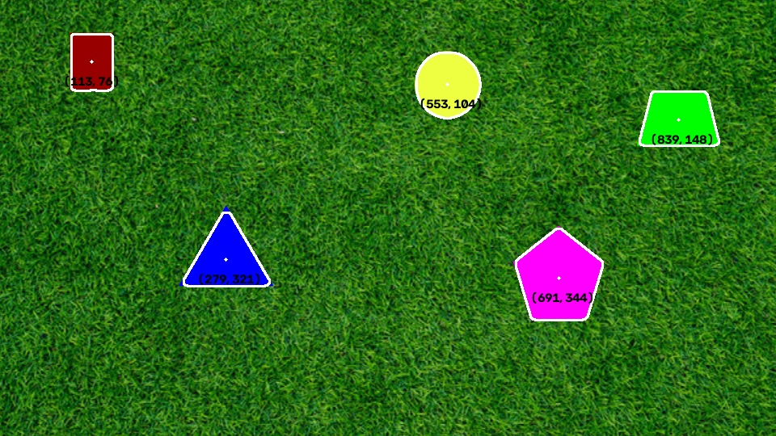

# pennairsoftware

i am not going to commment on test.py it's kept purely for messy (not) quick testing

to run the code:
let n represent any int 
go to Part{n}.py, and just press run.
the output should go to the Part{n} folder
you can delete the preexisting output
to see it actually replace it with a new output

i started in codespaces so all my code outputs to files not popups

Parts:

Part 1
Total time: 20.81 seconds
I ended up using adapative bilateral filtering generated by claude based on this lengthy paper because it preserved enough of the triangle's corners that I was satisified. That didn't take too long to implement. I compared it in part 2 to other ximg built in filters and I think it still did best on the static image or no difference. I spent a really long time confused in the beginning because my canny edges had the colors like flipped so I was getting contour outlines of the background, which is basically the border. I finally figured out that I just needed to invert it.

The times for part 2 and 4 might be longer because I ran them at the same time. I compared the times and results of the algorithms guided filtering, rolling guided, single channel adaptive bilateral filtering, and bilateral filtering on a static image, and I thought rolling guided ran in a reasonable time and had reasonable contour outlines. I had to tweak the kernel size for part 3 and part 4, it made it a lot slower, but needed for noise filtering.

Part 2
Total time: 267.99 seconds
<video src="https://github.com/user-attachments/assets/6efca311-0e6f-469c-b3a7-aaa897104a4f" width="480" height="270" controls></video>

Part 3
Total time: 249.76 seconds
<video src="https://github.com/user-attachments/assets/6f62c194-cc9e-4e97-931b-c745cc1f7591" width="480" height="270" controls></video>

Part 4
Total time: 311.64 seconds
<video src="https://github.com/user-attachments/assets/e4fd9f6a-2beb-4326-9fdc-39bbea6d55ee" width="480" height="270" controls></video>
